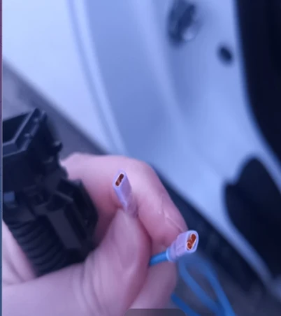
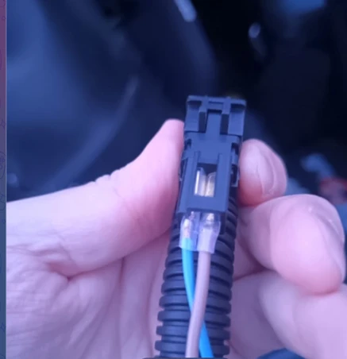
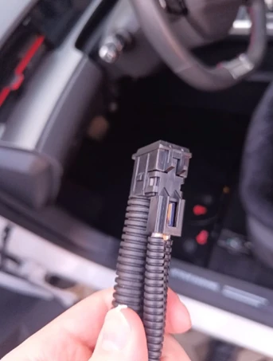
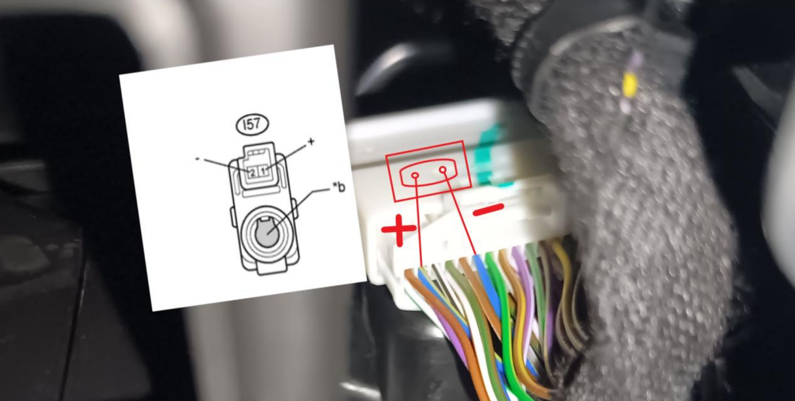
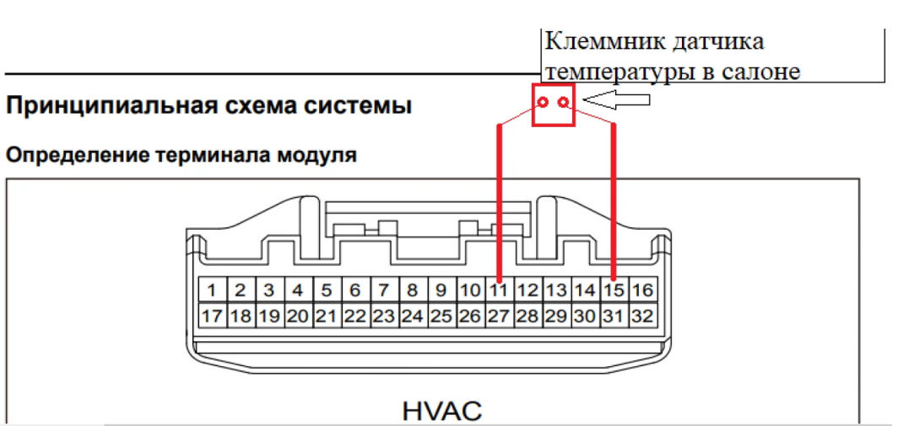
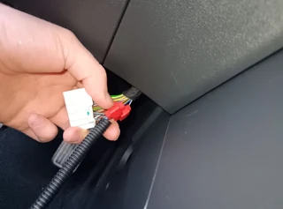
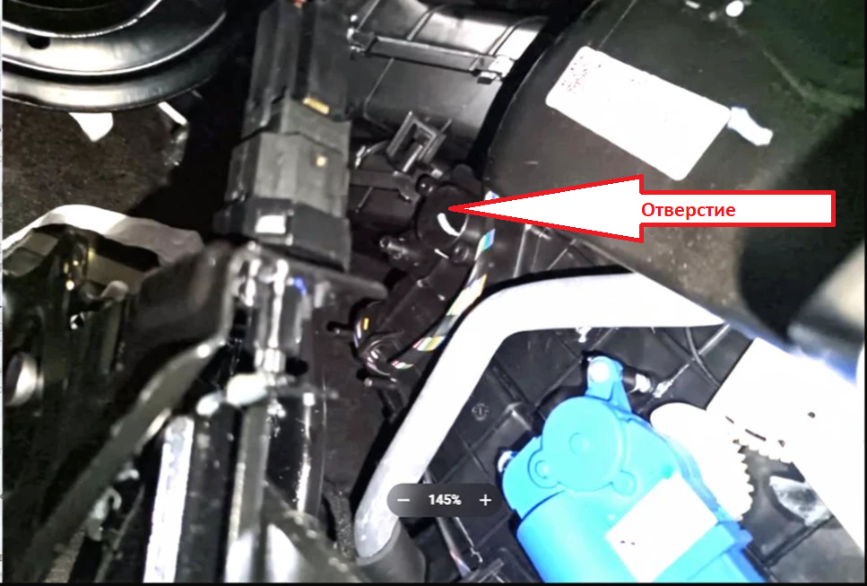
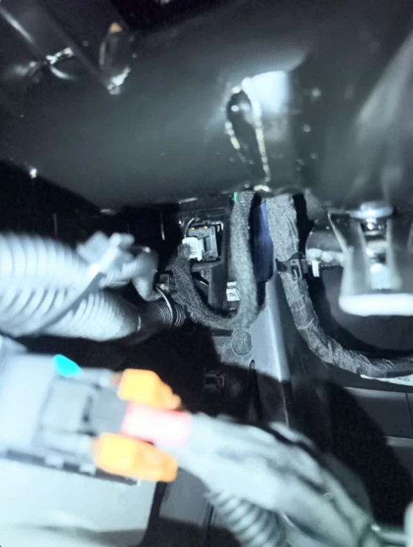
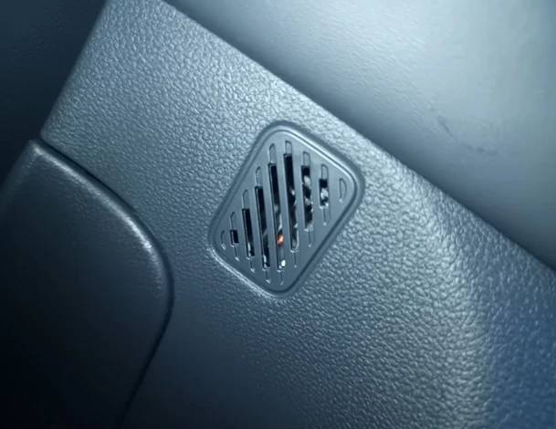
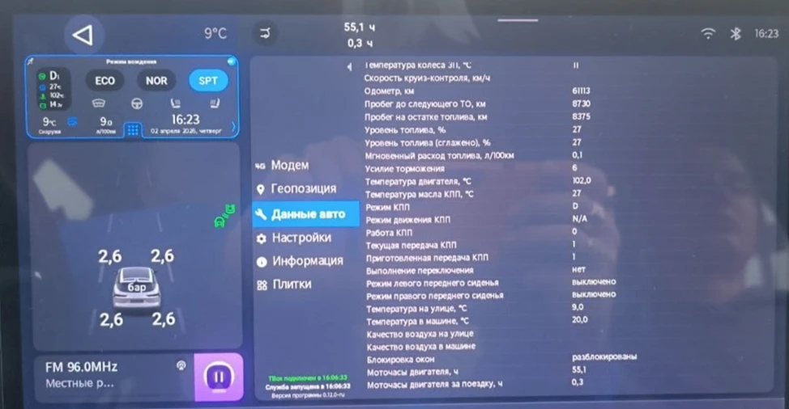

# Установка датчика температуры в салоне Jetour Dashing 1.5 и активация климат контроля (только 9 android)

[Версия в pdf](./(инструкция)%20Установка%20датчика%20температуры%20в%20салоне%20для%201.5%20(2).pdf)

## Предупреждение
Все дальнейшие действия описаны и выполнены для автомобиля 1.5 (комплектация
«Лакшери») с системой Android 9.
Внесение изменений осуществляется на ваш страх и риск!!!

После изменения кодировки могут перестать работать некоторые функции, например круиз-контроль.

## Необходимое оборудование и ПО

1. Датчик температуры воздуха в салоне (артикул: F16-8107066).
1. Клеммы обжимные для проводов набор, (озон артикул: 2299261725).
1. Инструмент для обжатия клемм.
1. Два провода сечением 0,75 мм² (длина — по месту установки, с запасом
примерно по 60см).
1. Пластиковые лопатки для снятия обшивки, изолента или термоусадка,
стяжки и гофра автомобильная (озон артикул: 2317979751)
1. Проколы для проводов сечение от 0,5 мм² до 1,5 мм² ( озон артикул: 1709614229 )
1. Винт самонарезающий 4.3х15.9; 4 на 16 (озон артикул: 718978900)
1. Гравер.
1. Приложение T-BOX (опционально для проверки, устанавливается на ГУ)
1. Сканер с возможностью чтения и записи кодировок блоков, например Launch;
1. Программа [DashingCodeGenerator](./DashingCodeGenerator.md) (только Android устроёства).

## Изменение кодировки блока
Блоки, кодировку которых необходимо менять:
- IHU

Блок IHU:

1. Выбираем блок IHU;
1. Выбираем кодировку соответствующую вашей комплектации (или вводим вручную текущую кодировку полученную сканером);
1. В списке функций ищем **EngineType** (тип ДВС) и устанавливаем **16T**;
1. Нажимаем кнопки **Generate** и **Copy** для копирования изменённоё кодировки в буфер обмена устройства;
1. Далее записываем скопированную кодировку в блок IHU сканером.

## Подготовка к подключению датчика

1. Отключите минусовую клемму аккумулятора. (рекомендация)
1. Обжать клеммы на проводах для подключения к датчику температуры и установить термоусадку  

1. Подключить провода к датчику температуры.  

1. Натянуть гофру на провода  

## Подключение датчика

1. Найдите штатный разъём HVAC (с правой стороны от педали газа сбоку у центральной
консоли).
1. Подключите провода к датчику температуры в салоне: один — к сигнальному контакту №15, второй — к массе к контакту №11.  

1. Для подключения можно использовать проколы для проводов сечение от 0,5 мм² до 1,5 мм² ( озон артикул: 1709614229 )  

1. Так же необходимо просверлить отверстие под трубку датчика температуры и смонтировать её.  

1. Установить датчик в штатное место в торпеде.  

## Проверка работоспособности датчика с помощью приложения T-BOX

Проверить работу датчика можно в приложении T-BOX.

1. Вкладка “Данные авто”
1. Параметр “Температура в машине °C
1. Данный параметр должен отличаться от 20,0 (будет меняться в зависимости от текущей температуры)

## Благодарность
За предоставленную инструкцию можно выразить благодарность автору Никите по [ссылке](https://www.sberbank.ru/ru/choise_bank?requisiteNumber=79969272247&bankCode=100000000111) или с помощью QR:

